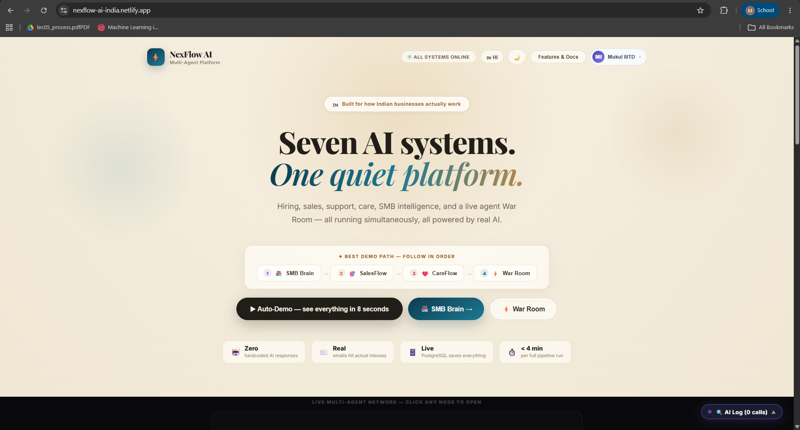
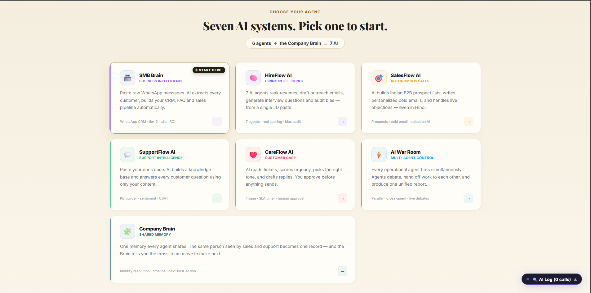
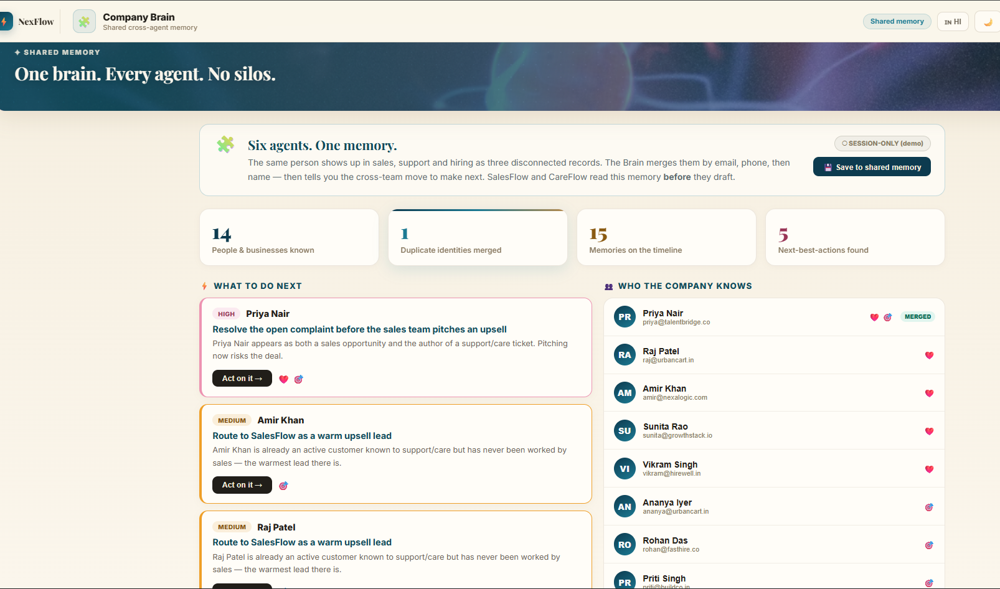
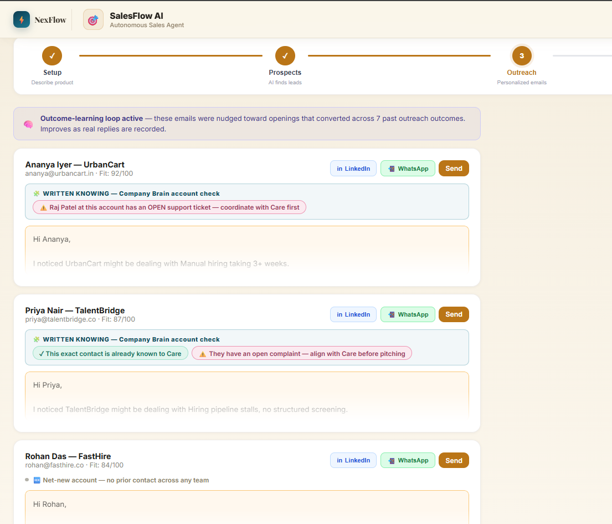
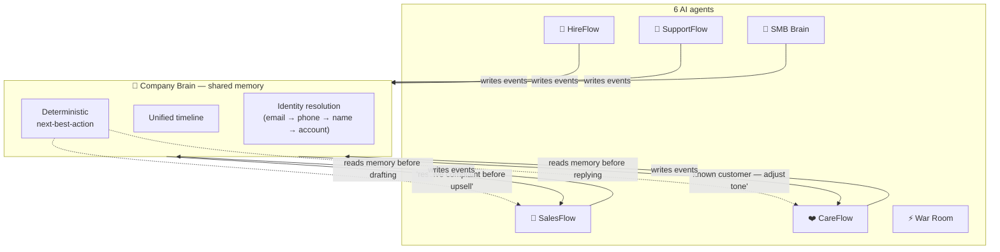

<div align="center">

# 🧩 NexFlow AI

### Multi-Agent Business Intelligence Platform for Indian SMBs

**Six AI agents that share one memory — so the same customer is recognized across every team.**

[](https://nexflow-ai-india.netlify.app)
&nbsp;
[](.github/workflows/ci.yml)
&nbsp;
[](src/lib)
&nbsp;
[](LICENSE)

<br/>


</div>

---

> **Live demo → [nexflow-ai-india.netlify.app](https://nexflow-ai-india.netlify.app)**
> Sign in with Google, email/password, or click **Try Demo** for instant access — no signup needed.

**NexFlow AI** runs six specialized AI agents — hiring, sales, support, customer care, SMB intelligence, and a live War Room — and binds them with a seventh system, the **Company Brain**: one shared memory every agent reads from *before* it acts. Seven AI systems in all. Built for how Indian businesses actually work.

---

## 📑 Table of Contents

- [📸 Screenshots](#-screenshots)
- [✨ The closed loop — what makes this different](#-the-closed-loop--what-makes-this-different)
- [⚡ 90-second demo (for reviewers)](#-90-second-demo-for-reviewers)
- [🤖 The seven systems](#-the-seven-systems)
- [🌟 Key features](#-key-features)
- [🏗️ Architecture](#️-architecture)
- [💰 Real cost of running this](#-real-cost-of-running-this)
- [🔒 Data privacy (India's DPDP Act, 2023)](#-data-privacy-indias-dpdp-act-2023)
- [🧪 Testing & CI](#-testing--ci)
- [✅ Validation — what's real vs. what's a demo](#-validation--whats-real-vs-whats-a-demo)
- [⚠️ Known limitations](#️-known-limitations)
- [🧰 Tech stack](#-tech-stack)
- [🚀 Local development](#-local-development)
- [🔑 Environment variables](#-environment-variables)

---

## 📸 Screenshots

<div align="center">



<sub><b>Landing</b> — seven AI systems, one platform. Cream editorial UI, guided demo path, and a live agent network.</sub>

<br/><br/>



<sub><b>Choose your agent</b> — six agents + the Company Brain = 7 AI. SMB Brain leads with <i>Start here</i>; Team is separated below as a non-AI admin feature.</sub>

<br/><br/>



<sub><b>Company Brain</b> — duplicate identities merged across teams, ranked next-best-actions, one-click routing.</sub>

<br/><br/>



<sub><b>The closed loop</b> — SalesFlow reads shared memory before drafting and warns that this account has an open support ticket.</sub>

</div>

---

## ✨ The closed loop — what makes this different

Most "multi-agent" tools run agents in parallel and call it collaboration. Here the agents **write to and read from one shared memory — the Company Brain — before they act.** The same person seen by two teams becomes one record, and each agent adapts its output to what every other team already knows.



> **💡 The moment the demo shows live:** Raj files a billing complaint in **CareFlow** (UrbanCart). Later, **SalesFlow** generates a prospect — Ananya, also at UrbanCart. Before writing her cold email, SalesFlow reads the Brain, sees the open complaint at that **account**, and flags *"coordinate with Care first"* — both on screen and injected into the email prompt. No single agent could see that. The shared memory makes it obvious.

**The one-line pitch:** *six agents that don't share memory are still six silos. The Company Brain gives them one.*

---

## ⚡ 90-second demo (for reviewers)

| Step | Do this | What to notice |
|:--:|---|---|
| 1 | Open the live demo → click **Try Demo** | No login needed |
| 2 | **CareFlow** → open the *"Interested in Enterprise plan"* ticket → **Generate response** | The teal **🧩 Written knowing** chip — reply drafted with cross-team memory, not blind |
| 3 | **SalesFlow** → **Generate prospects** → **Outreach** tab → find **Ananya @ UrbanCart** | **⚠️ "Raj Patel at this account has an OPEN support ticket"** — same context injected into the email prompt |
| 4 | **Company Brain** | Every person **merged** into one record, ranked **next-best-actions**, **Act on it →** routes to the right agent |
| 5 | *(offline)* `node scripts/brain-scenario.mjs` | The same logic, reproducible, in 2 seconds — no browser |

---

## 🤖 The seven systems

> **6 AI agents + the Company Brain = 7 AI systems.** (Team is an admin feature, not an AI system.)

| System | Type | What it does |
|---|:--:|---|
| 🏪 **SMB Brain** | Agent | Paste raw WhatsApp chats → structured CRM + FAQ + sales pipeline for tier-2 Indian businesses |
| 🧠 **HireFlow AI** | Agent | 7-agent hiring pipeline: JD analysis, bulk resume screening, bias audit, salary benchmarking, outreach, interview Qs |
| 🎯 **SalesFlow AI** | Agent | Indian B2B prospect generation, personalized cold emails, drip sequences, live objection handler |
| 💬 **SupportFlow AI** | Agent | KB builder from raw docs, sentiment detection, real-time chat bot, escalation routing |
| ❤️ **CareFlow AI** | Agent | Dynamic ticket triage, human-in-the-loop approval, WhatsApp response delivery |
| ⚡ **AI War Room** | Agent | All operational agents fire in parallel (`Promise.all`), cross-agent handoffs stream live, unified command report |
| 🧩 **Company Brain** | Memory | Shared cross-agent memory — identity resolution, unified timeline, deterministic next-best-action |

---

## 🌟 Key features

- **🧩 Shared cross-agent memory** — the same person across teams collapses into one record (matched email → phone → name → account); SalesFlow and CareFlow read it *before* drafting.
- **🎙️ Voice input** — Web Speech API on the JD field and product description.
- **🇮🇳 English / Hinglish AI toggle** — AI switches to natural Roman-script Hinglish; floating toast confirms the mode change.
- **⚖️ Deterministic India-compliance checks** — regex flags for age-proxy language, gendered titles, missing equal-opportunity statements, salary-secrecy clauses, and over-specified experience, referenced against the **Equal Remuneration Act, POSH Act, and Code on Wages** — not a generic Western checklist. Reproducible: the same JD always produces the same flags. See `lib/indiaComplianceRules.js`.
- **🧠 Outcome-learning loop** — SalesFlow outreach is nudged toward message openings that have actually converted (`lib/outcomeLearning.js`), with an "Outcome-learning loop active" banner.
- **📲 WhatsApp send** — pre-filled `wa.me` deep links in SalesFlow outreach and CareFlow responses.
- **📋 Bulk resume processor** — paste 10+ resumes separated by `---`; AI parses, scores, and ranks against the JD. The local split/name-extraction step is unit-tested and benchmarked (`node scripts/benchmark-resume-parsing.mjs`, ~0.2ms for 200 resumes).
- **🔄 Groq key rotation** — round-robin across up to 4 API keys with automatic retry on a dead/expired key (401/403) instead of silently returning empty.
- **📊 Transparent AI** — a live backend panel shows every token, every key, every API call in real time.

---

## 🏗️ Architecture

```
┌─────────────────────────────────────────────────────────────┐
│                        BROWSER CLIENT                        │
│   AuthScreen ──→ Supabase Auth (email/password + Google)    │
│        ▼                                                     │
│   ┌──────────┐  ┌──────────┐  ┌──────────┐  ┌──────────┐    │
│   │ HireFlow │  │SalesFlow │  │SupportBot│  │  CareBot │    │
│   └────┬─────┘  └────┬─────┘  └────┬─────┘  └────┬─────┘    │
│        └─────────────┴─────────────┴────────────┘           │
│                  🧩 COMPANY BRAIN (shared memory)            │
│         identity resolution · timeline · next-best-action    │
│                  ⚡ WAR ROOM (command center)                │
│              ActivityPanel (live Groq API log)               │
└──────────────────────────┬──────────────────────────────────┘
            ┌──────────────┴──────────────┐
   GROQ API (Llama 3.3 70B)       SUPABASE (PostgreSQL)
   Round-robin API keys           pipeline_runs, candidates, sales,
   SSE streaming + JSON           care_tickets, brain_events + RLS
```

<details>
<summary><b>📂 Repository structure</b> (click to expand)</summary>

```
src/
  App.jsx                  # frontend (~6,050 lines, single-file by design)
  BulkResumeProcessor.jsx  # resume parsing + scoring
  BiasAudit.jsx            # JD bias detection
  RejectionFlow.jsx        # candidate decision bar
  PipelineHistory.jsx      # Supabase run history
  ProjectOverview.jsx      # features & docs page
  SampleData.js            # candidate pool, domain detection
  ResumeBank.js            # 50+ sample resumes across 8 domains
  lib/
    db.js                     # Supabase REST helpers, incl. brain persistence + deleteAllUserData
    supabase.js               # pure-fetch Supabase client (insert/select/update/delete)
    groqKeyRotation.js        # Groq API key round-robin ...................... unit tested
    resumeParsing.js          # resume batch split + name extraction ......... unit tested, benchmarked
    indiaComplianceRules.js   # deterministic India-law JD checks ............ unit tested, wired live
    indianVerification.js     # PAN/GSTIN/Udyam format+checksum validation .... unit tested
    outcomeLearning.js        # outreach outcome tracker ..................... unit tested, wired into Sales
    costEstimator.js          # real Groq-pricing cost estimation ............ unit tested
    companyBrain.js           # 🧩 shared cross-agent memory engine .......... unit tested, wired into Sales/Care
    brainContext.js           # read-side of the loop (person + account) ..... unit tested
    modeAccess.js             # role → visible modes, fail-open by design .... unit tested
scripts/
  benchmark-resume-parsing.mjs  # node scripts/benchmark-resume-parsing.mjs
  brain-scenario.mjs            # node scripts/brain-scenario.mjs — reproducible closed-loop proof
supabase/                       # all DB SQL in run-order (00_run_all.sql = one-shot) + README
docs/
  closed-loop.mermaid           # architecture diagram of the shared-memory loop
```

**State:** a single `useReducer` at the root. **AI:** module-level `callClaude()` / `callClaudeStream()` with round-robin key rotation and SSE streaming.

</details>

---

## 💰 Real cost of running this

A common gap in "AI for SMBs" pitches is that nobody says what it costs to run. This one does — computed from Groq's **published pricing**, not estimated:

- Groq pricing for `llama-3.3-70b-versatile`: **$0.59 / M input tokens, $0.79 / M output tokens** (source: [groq.com/pricing](https://groq.com/pricing), checked July 2026 — re-verify before quoting).
- A full HireFlow pipeline run (8 Groq calls) comes to **≈ $0.002 (≈ ₹0.19** at ~95.5 INR/USD), computed in `lib/costEstimator.js` and reproducible:

```bash
node -e "
const { estimatePipelineCost } = await import('./src/lib/costEstimator.js');
console.log(estimatePipelineCost([
  {promptChars:1200,outputChars:800},{promptChars:2000,outputChars:600},
  {promptChars:900,outputChars:400},{promptChars:600,outputChars:300},
  {promptChars:700,outputChars:500},{promptChars:700,outputChars:500},
  {promptChars:700,outputChars:500},{promptChars:800,outputChars:600},
]));
"
```

> At **1,000 runs/month** — a genuinely high-usage SMB — that's about **₹190/month** in Groq compute. The exchange rate is a documented parameter, not a hardcoded snapshot, so it can't quietly go stale.

---

## 🔒 Data privacy (India's DPDP Act, 2023)

This app stores names, emails, salaries, and phone numbers — personal data under India's **Digital Personal Data Protection Act, 2023**. Two things exist specifically for it:

- **`deleteAllUserData(userId)`** in `lib/db.js` — a real data-subject deletion function. Deleting `pipeline_runs` cascades to `candidates` and `outreach_emails` via `on delete cascade`; `sales_sessions`, `support_sessions`, and `care_tickets` are deleted directly. (Ready to call; needs a settings-page button to wire in.)
- **`supabase/03_rls_v2_fix.sql`** — while checking that deletion path, I found the original RLS never dropped the permissive `"public access"` policies, so **any holder of the anon key could read/write every user's data** regardless of the newer per-user policies. This file drops them and adds the missing UPDATE/DELETE policies. **This is disclosed, not hidden** — see [Validation](#-validation--whats-real-vs-whats-a-demo) and [Known limitations](#️-known-limitations).

---

## 🧪 Testing & CI

```bash
npm test                              # 10 Vitest suites, 100+ unit tests
node scripts/brain-scenario.mjs       # reproducible closed-loop proof (2s, no browser)
node scripts/benchmark-resume-parsing.mjs   # measured local throughput
```

`npm test` covers Groq key rotation, resume batch-parsing, India compliance rules, PAN/GSTIN/Udyam verification, outcome learning, cost estimation, **the Company Brain engine** (identity resolution, insight determinism, seed replay), **the Brain-context read layer** (`brainContext.test.js` — person- and account-level memory Sales/Care read before drafting), **role-based mode access** (`modeAccess.test.js` — a regression guard proving that signing in never removes features), and the Supabase helpers' fallback behavior. **GitHub Actions** runs the suite + a production build on every push and PR.

> **Prove the closed loop in 2 seconds, no browser:** `node scripts/brain-scenario.mjs` runs a fixed, labeled scenario through the exact engine the app uses and prints the merged identities + deterministic next-best-actions. Same output every run — reproducible, not a demo trick.

*The React component layer is manually-tested, not yet regression-tested — see limitations.*

---

## ✅ Validation — what's real vs. what's a demo

Being explicit about the maturity of each claim, because "it works" means different things:

| Component | Status | How it's validated |
|---|:--:|---|
| Company Brain engine (identity resolution, next-best-action) | 🟢 **Proven & deterministic** | Unit tests + `brain-scenario.mjs`. Same input → same output, every run. |
| The closed loop (agents read memory before drafting) | 🟢 **Working in-app** | Visible in CareFlow + SalesFlow chips; context injected into the live LLM prompt. |
| Deterministic India-compliance JD checks | 🟢 **Proven** | Unit tests referenced against the legal framework. |
| PAN / GSTIN / Udyam checksum validation | 🟡 **Proven (format only)** | Unit-tested against the standard public GSTIN vector. Does not hit any government registry. |
| LLM outputs (bias score, sentiment, rankings, drafts) | 🟡 **Draft for human review** | Not validated against labeled ground truth. |
| Live Groq API end-to-end | 🟢 **Verified — measured** | `node scripts/real-run.mjs`, 4 real calls, real latency/tokens/cost. Log below. |
| End-to-end on **real customer** data | 🔴 **Not yet** | The API layer and the loop are verified against the live model, but the *inputs* are still synthetic, project-authored records — not real resumes/tickets from a real business. |

### Real-run log — 2026-07-19

Executed `node scripts/real-run.mjs` against the **live Groq API** (`llama-3.3-70b-versatile`).
Real calls, real latency, real tokens — no mocks, reproducible on any machine with a key.

| Step | Latency | Tokens (in/out) |
|---|--:|--:|
| JD analysis | 433 ms | 110 / 75 |
| Bias audit | 1142 ms | 90 / 321 |
| SalesFlow email **with Company Brain context** | 1920 ms | 136 / 303 |
| CareFlow reply **with Company Brain context** | 916 ms | 155 / 203 |
| **Total** | **4411 ms** | **491 / 902** |

Measured cost for the run: **$0.00100 (≈ ₹0.096)** at Groq's published pricing
($0.59/M in, $0.79/M out; ₹95.5/USD) — consistent with the ₹0.19 full-pipeline estimate above.

The Company Brain injected this cross-team context **before** the sales email was generated:
> ✓ This exact contact is already known to Care
> ⚠️ They have an open complaint — align with Care before pitching

**And the model demonstrably used it.** The generated email came back with:

> *"Before I dive into the details of our solution, I wanted to acknowledge that we're aware of
> your existing relationship with our team, particularly with Care."*

That is the closed loop working end-to-end on a live model: a deterministic cross-team fact
from `lib/companyBrain.js` changed what the LLM actually wrote. The context itself is identical
on every run and does not depend on the model.

*This table is deliberately conservative. The core memory + reasoning genuinely work and reproduce in seconds; the honest gap is real-world usage, stated plainly rather than glossed over.*

---

## ⚠️ Known limitations

- **WhatsApp delivery** uses CallMeBot, a free hobbyist API with no SLA — fine for demos, not production. A real deployment should move to the WhatsApp Business API.
- **No automated tests on the UI layer.** `App.jsx` is a single ~6,050-line file. The logic libraries (`companyBrain`, `brainContext`, `groqKeyRotation`, `resumeParsing`, `indiaComplianceRules`, `indianVerification`, `outcomeLearning`, `costEstimator`) are all extracted and unit-tested; the component tree isn't yet split out or tested.
- **Bias audit, salary benchmarking, and sentiment are LLM outputs**, not validated against labeled ground truth — a starting draft for human review.
- **Sample data is synthetic**, authored for this project — not real anonymized postings. Salary figures are illustrative, not from a specific survey.
- **The RLS gap** (fixed in `03_rls_v2_fix.sql`) means any DB built before that fix exposed all users' data to the anon key. If you deployed earlier, run the fix and rotate your anon key.

<details>
<summary><b>Built & tested, wiring in progress</b> (click to expand)</summary>

- **`lib/indianVerification.js`** — PAN/GSTIN/Udyam format + checksum validation (verified against public vector `27AAPFU0939F1ZV`). Validates *shape*, does not hit a government registry. One input + one call to wire into SalesFlow/HireFlow.
- **`lib/outcomeLearning.js`** — **now wired into SalesFlow** (outreach nudged toward best-performing openings, with a live banner). Currently seeded with a clearly-labeled illustrative history (`SEED_OUTREACH_HISTORY`); swap for real Supabase events for true live learning.
- **`deleteAllUserData(userId)`** — ready to call; needs a settings-page button.

</details>

---

## 🧰 Tech stack

| Layer | Technology |
|---|---|
| **Frontend** | React 18 + Vite 4, Framer Motion, Tailwind |
| **AI** | Groq API · Llama 3.3 70B — SSE streaming + non-streaming JSON |
| **Data** | Supabase (PostgreSQL) — Auth, Row Level Security, multi-tenancy |
| **Email** | EmailJS — real transactional delivery |
| **Voice** | Web Speech API — English / Hinglish switching |
| **CI** | GitHub Actions — test suite + production build on every push/PR |

---

## 🚀 Local development

```bash
git clone https://github.com/Mukul07777/hireflow-ai.git
cd hireflow-ai
npm install
# create .env with your keys (see below)
npm run dev       # start dev server
npm test          # run unit tests
npm run build     # production build
```

**Database setup** — all SQL lives in [`supabase/`](supabase/), in run-order:

```
Easiest:  open supabase/00_run_all.sql → paste into the Supabase SQL editor → Run.
          (Files 01–06 concatenated in order; fully idempotent — safe to re-run.)

Or individually, in order:
  01_schema.sql · 02_rls.sql · 03_rls_v2_fix.sql
  04_multitenancy.sql · 05_cross_signals.sql · 06_company_brain.sql
```

See [`supabase/README.md`](supabase/README.md) for what each file does.

> **Before trusting multi-tenancy live:** every `create policy` is guarded with `drop policy if exists`, so re-running never errors — but RLS isolation is invisible until tested with **two logins**. Sign up as User A and User B and confirm B cannot read A's data.

**Known gap:** there's no "create vs. join a company" screen yet — every first login auto-provisions a new company and makes that user its admin. To invite someone, do it from the Team screen *before* they sign up.

---

## 🔑 Environment variables

Add to **Netlify → Site settings → Environment variables** (and a local `.env`):

```bash
VITE_GROQ_API_KEY=your_primary_groq_key
VITE_GROQ_API_KEY_2=your_second_key
VITE_GROQ_API_KEY_3=your_third_key
VITE_SUPABASE_URL=https://your-project.supabase.co
VITE_SUPABASE_ANON_KEY=your_anon_key
VITE_CALLMEBOT_PHONE=+91XXXXXXXXXX
VITE_CALLMEBOT_APIKEY=your_callmebot_key
```

**WhatsApp setup (CallMeBot, free):** send `I allow callmebot to send me messages` to **+34 644 59 97 91** on WhatsApp; it replies with your API key. Without these, WhatsApp buttons fall back to `wa.me` deep links.

> ⚠️ **Never commit `.env`.** Keys live in Netlify env vars only. If a key ever lands in a commit, rotating it isn't optional — deleting the file later does **not** remove it from git history.

---

<div align="center">

**Built for how Indian businesses actually work.**
*Six agents that don't share memory are still six silos. The Company Brain gives them one.*

[](https://nexflow-ai-india.netlify.app)

</div>
